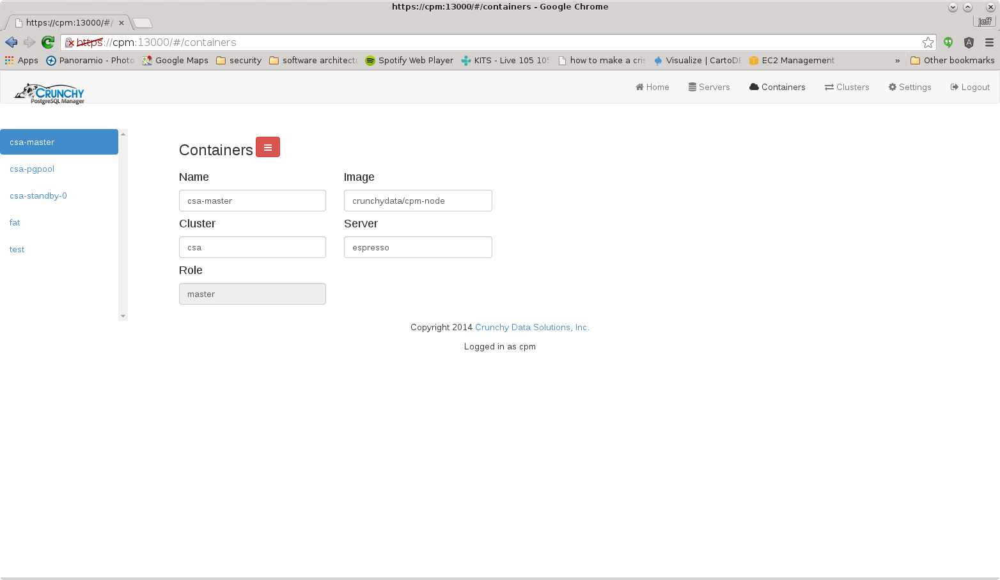

Crunchy Postgresql Manager (Beta v0.9.5)
==========================

Crunchy Postgresql Manager (CPM) is a Docker-based solution which
provides an on-premise PostgreSQL-as-a-Service platform.

CPM allows for the quick provisioning of PostgreSQL databases
and streaming replication clusters.  

CPM also allows you to monitor and administer PostgreSQL
databases.  Currently CPM only works with databases that have
been provisioned by CPM.

A user guide is available at:
[docs/userguide/user-guide.md](docs/userguide/user-guide.md)

Installation
------------

There are 2 installs of CPM available, a user install and a developer
install.

The user install allows you to get CPM up and running quickly by
downloading pre-built binaries and Docker images.

The user installation archive can be downloaded from:
[https://s3.amazonaws.com/crunchydata/cpm/cpm.0.9.5-linux-amd64.tar.gz](https://s3.amazonaws.com/crunchydata/cpm/cpm.0.9.5-linux-amd64.tar.gz)

See docs/user-install.md for details on the user installation 
requirements.

For performing a user install, see the [docs/user-install.md](docs/user-install.md)
documentation.

The developer install is more difficult but allows you to build, 
configure, and develop new CPM functionality to suit your needs.

The developer install and setup is documented in [docs/dev-setup.md](docs/dev-setup.md)

Running CPM
===========

After a build, run the various CPM containers by running the following
script:

~~~~~~~~~~~~~~~~~~~~~~~~~
run-cpm.sh
~~~~~~~~~~~~~~~~~~~~~~~~~

This should start the the following containers:

* cpm - cpm.crunchy.lab - the nginx server that hosts the CPM
   	      web app, http://cpm.crunchy.lab:13001

* cpm-admin - cpm-admin.crunchy.lab - the REST API for CPM, http://cpm-admin.crunchy.lab:13001

* cpm-backup - cpm-backup.crunchy.lab - the backup process used by CPM to schedule and run backup jobs

* cpm-collect - cpm-collect.crunchy.lab - the monitoring process used 
to collect metrics, these metrics are collected by the Prometheus server
running as cpm-prometheus

* cpm-promdash - cpm-promdash.crunchy.lab - the Prometheus dashboard that can be used to view/query collected CPM metrics , graphs from this dashboard
are displayed within the CPM user interface, the user interface is
found at http://cpm-promdash:3000

* cpm-prometheus - cpm-prometheus.crunchy.lab - the Prometheus database
is found at http://cpm-prometheus:9090

Testing the Install
===========

After starting the CPM containers, you should be able to ping
each one of them and have the DNS name resolve.

You can view the running containers by issuing the following command:

~~~~~~~~~~~~~~~~~~~~~~~~~
docker ps
~~~~~~~~~~~~~~~~~~~~~~~~~

Shutting Down CPM
===========

To shut down CPM, run the following commands:

~~~~~~~~~~~~~~~~~~~~~~~~~
docker stop cpm
docker stop cpm-backup
docker stop cpm-collect
docker stop cpm-admin
docker stop cpm-promdash
docker stop cpm-prometheus
~~~~~~~~~~~~~~~~~~~~~~~~~
	

To start CPM, run the following commands:

~~~~~~~~~~~~~~~~~~~~~~~~~
docker start cpm
docker start cpm-backup
docker start cpm-collect
docker start cpm-admin
docker start cpm-promdash
docker start cpm-prometheus
~~~~~~~~~~~~~~~~~~~~~~~~~
	
